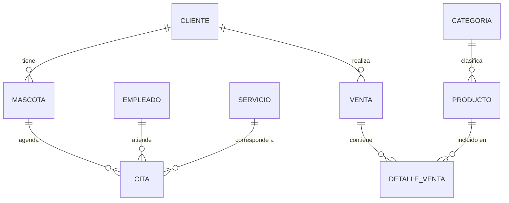

# Análisis de la Veterinaria Huellitas

## 1. Datos Generales
- Nombre: Veterinaria Huellitas
- Giro: Comercio mixto (presta servicios de salud a mascotas y a su vez comercializa medicamentos y productos veterinarios)
- Tamaño: Pequeña (actualmente maneja todo por cuadernos y hojas de cálculo)

## 2. Procesos Clave

- **Ventas:** El cliente entra a la tienda y solicita el producto o servicio necesario. La recepcionista verifica si hay stock del producto o disponibilidad de agenda para el servicio solicitado. Se le indica la cantidad disponible y el precio al cliente, y sus datos se almacenan en la base de datos para futuras compras o para hacer seguimiento de su mascota si se convierte en cliente recurrente.

- **Servicios:** El cliente solicita el servicio (consulta, vacunación, cirugía, baño o peluquería). En recepción se verifica si ese servicio es prestado por la veterinaria y se revisa la agenda disponible, informando al cliente los horarios posibles. Si el cliente acepta el tiempo de espera, se agenda la cita para la fecha y hora disponibles, tomando sus datos para un recordatorio. El día de la cita se realiza el servicio, se genera la cotización de lo realizado y se registra en la base de datos.

- **Compras:** La recepcionista o el auxiliar veterinario (idealmente una persona dedicada a esta tarea) realiza semanalmente un conteo de cada producto en stock. Según el movimiento de cada producto o la cantidad restante, se solicita el reabastecimiento a los proveedores correspondientes. Se documenta por escrito la cantidad solicitada de cada medicamento y el motivo, para mantener trazabilidad.

- **Inventario:** El stock se controla mediante un conteo diario al cierre de cada jornada, contrastando lo vendido con lo que queda disponible, lo que da mayor trazabilidad y evita descuadres. Adicionalmente, se revisa diariamente la fecha de vencimiento de los medicamentos, aplicando la lógica FEFO (First Expired, First Out): se despachan primero los lotes con fecha de vencimiento más próxima.

- **Clientes:** De cada dueño se registra nombre, teléfono, correo y sus mascotas asociadas. De cada mascota se guarda nombre, edad, tamaño, peso, tipo de animal y raza (si aplica), además de su historia clínica para llevar un control y seguimiento riguroso de su salud.

## 3. Problemas Detectados

1. Pérdida de información importante de cada mascota al manejar todo por cuadernos u hojas de Excel, ya que un cuaderno puede extraviarse y una hoja de Excel puede eliminarse fácilmente por error. Esto no permite garantizar un manejo correcto del historial de cada mascota, siendo crítico en aquellas que requieren seguimiento clínico riguroso.

2. Por razones de tiempo, el conteo de cada medicamento puede no realizarse durante una o dos semanas, generando quiebres de stock al momento de necesitarlo.

3. Un mal manejo de los lotes por vencimiento genera riesgo en la venta y salida de productos, ya que un error humano al vender un medicamento vencido puede ser fatal para la mascota.

## 4. Justificación del ERP

La Veterinaria Huellitas necesita un ERP con urgencia debido a que, al hacerse más reconocida en la ciudad, está teniendo un crecimiento positivo de clientes. Sin embargo, al no seguir procedimientos organizados y presentar inconsistencia de información, mal manejo de inventario y desorganización en las citas agendadas, corre el riesgo de perder clientes potenciales y clientes ya fidelizados si no logra sostener ese crecimiento con procesos confiables.

---

# Diseño del Modelo de Datos

## Diagrama Entidad-Relación

**Relaciones:**
- Cliente 1:N Mascota
- Mascota 1:N Cita
- Empleado 1:N Cita
- Servicio 1:N Cita
- Categoria 1:N Producto
- Cliente 1:N Venta
- Venta N:M Producto (a través de la tabla pivote `detalle_ventas`)

## Diccionario de Datos

| Tabla | Campo | Tipo | Descripción |
|---|---|---|---|
| clients | id | BIGINT | Identificador único |
| clients | name | VARCHAR(150) | Nombre del dueño |
| clients | phone | VARCHAR(20) | Teléfono de contacto |
| clients | email | VARCHAR(150) | Correo del dueño |
| pets | id | BIGINT | Identificador único |
| pets | name | VARCHAR(100) | Nombre de la mascota |
| pets | species | VARCHAR(50) | Especie (perro, gato, etc.) |
| pets | breed | VARCHAR(50) | Raza (si aplica) |
| pets | age | INT | Edad de la mascota |
| pets | client_id | BIGINT | FK al dueño |
| products | id | BIGINT | Identificador único |
| products | name | VARCHAR(150) | Nombre del producto |
| products | price | DECIMAL(10,2) | Precio unitario |
| products | stock | INT | Cantidad disponible |

---

# Propuesta de Solución ERP

## 1. Módulos del ERP

1. Módulo de Clientes
2. Módulo de Mascotas
3. Módulo de Productos (incluye gestión de categorías)
4. Módulo de Servicios
5. Módulo de Ventas
6. Módulo de Empleados

## 2. Relación entre módulos (flujo completo)

Cuando un cliente llega con su mascota a consulta: primero solicita el producto o servicio necesario. Se verifica que el servicio pueda prestarse o que haya stock del producto. Se busca al cliente en la base de datos (módulo de Clientes); si no existe, se crea con sus datos. Luego se accede al módulo de Mascotas y se registra la mascota si no existe previamente. Después se dirige al módulo de Ventas o Servicios para generar la factura, asignando el veterinario o persona que atendió (módulo de Empleados), y se cierra la venta o el servicio.

## 3. KPIs relevantes

1. Producto más vendido
2. Servicio más solicitado
3. Fecha con mayor flujo de trabajo
4. Cliente más frecuente

## 4. Beneficios del ERP

1. **Trazabilidad y seguridad de la información**: los historiales médicos y datos de clientes/mascotas quedan centralizados, eliminando el riesgo de pérdida por cuadernos extraviados o archivos de Excel borrados por error.
2. **Control de inventario en tiempo real**: reduce quiebres de stock y, aplicando la lógica FEFO, evita el riesgo de vender medicamentos vencidos.
3. **Mejor organización de citas**: evita choques de horario y aprovecha mejor el tiempo de veterinarios y peluqueros.
4. **Toma de decisiones basada en datos**: los KPIs permiten planear compras, promociones y horarios con base en información real.

---

# Implementación (Punto 4)

- Migraciones creadas: `clients`, `pets`, `products`.
- Modelos creados con `$fillable` y relaciones: `Client` (hasMany Pet), `Pet` (belongsTo Client), `Product`.
- Seeder `ClientSeeder` ejecutado con 5 registros de prueba.
- Evidencia en capturas de pantalla: ver carpeta `docs/parcial/capturas/`.
